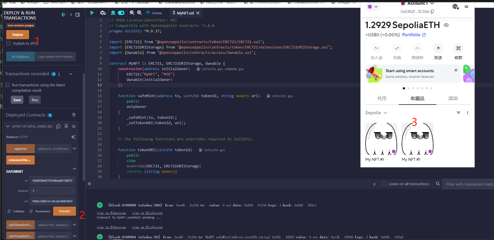
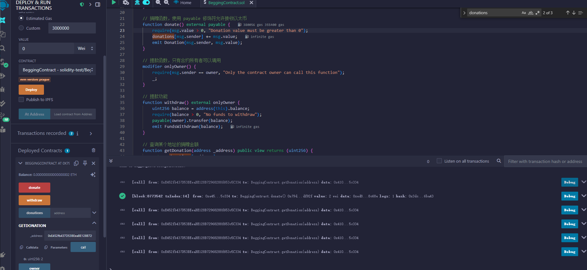

# 作业2：在测试网上发行一个图文并茂的 NFT,
<!-- 
    任务目标
    使用 Solidity 编写一个符合 ERC721 标准的 NFT 合约。,
    将图文数据上传到 IPFS，生成元数据链接。,
    将合约部署到以太坊测试网（如 Goerli 或 Sepolia）。,
    铸造 NFT 并在测试网环境中查看。,
    任务步骤
    编写 NFT 合约
    使用 OpenZeppelin 的 ERC721 库编写一个 NFT 合约。,
    合约应包含以下功能：,
    构造函数：设置 NFT 的名称和符号。,
    mintNFT 函数：允许用户铸造 NFT，并关联元数据链接（tokenURI）。,
    在 Remix IDE 中编译合约。,
    准备图文数据
    准备一张图片，并将其上传到 IPFS（可以使用 Pinata 或其他工具）。,
    创建一个 JSON 文件，描述 NFT 的属性（如名称、描述、图片链接等）。,
    将 JSON 文件上传到 IPFS，获取元数据链接。,
    JSON文件参考 https://docs.opensea.io/docs/metadata-standards,
    部署合约到测试网
    在 Remix IDE 中连接 MetaMask，并确保 MetaMask 连接到 Goerli 或 Sepolia 测试网。,
    部署 NFT 合约到测试网，并记录合约地址。,
    铸造 NFT
    使用 mintNFT 函数铸造 NFT：,
    在 recipient 字段中输入你的钱包地址。,
    在 tokenURI 字段中输入元数据的 IPFS 链接。,
    在 MetaMask 中确认交易。,
    查看 NFT
    打开 OpenSea 测试网 或 Etherscan 测试网。,
    连接你的钱包，查看你铸造的 NFT。 
-->

# 作业3：编写一个讨饭合约
<!-- 
    任务目标
    使用 Solidity 编写一个合约，允许用户向合约地址发送以太币。
    记录每个捐赠者的地址和捐赠金额。
    允许合约所有者提取所有捐赠的资金。 
 -->
